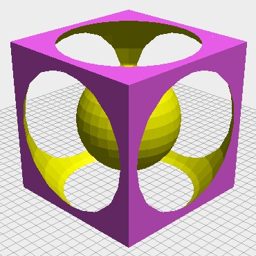
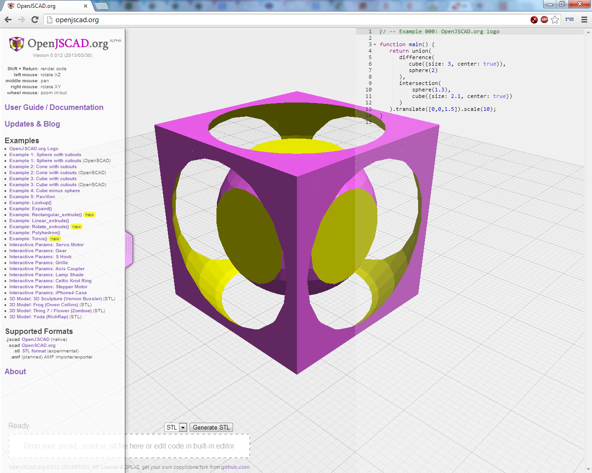
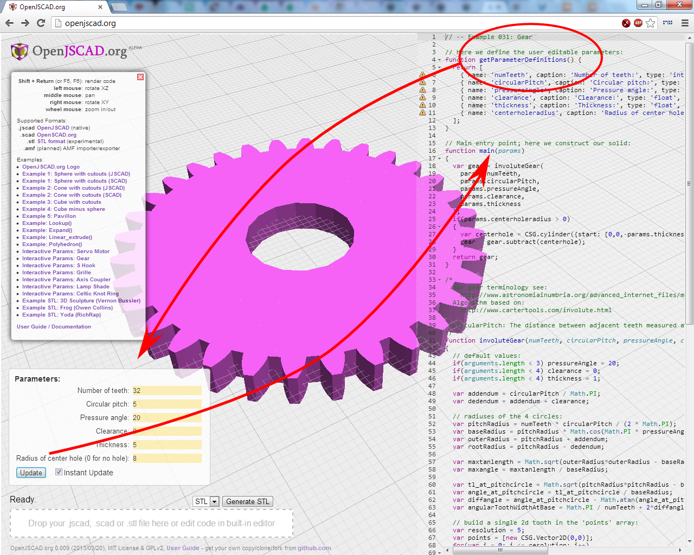
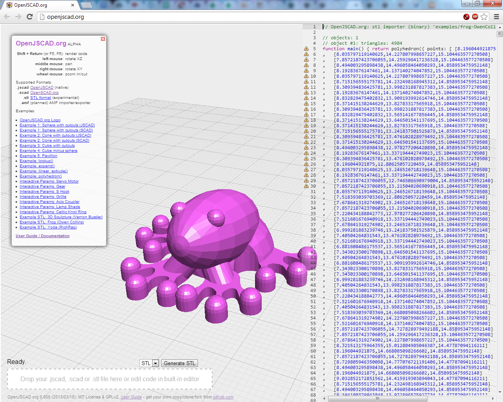
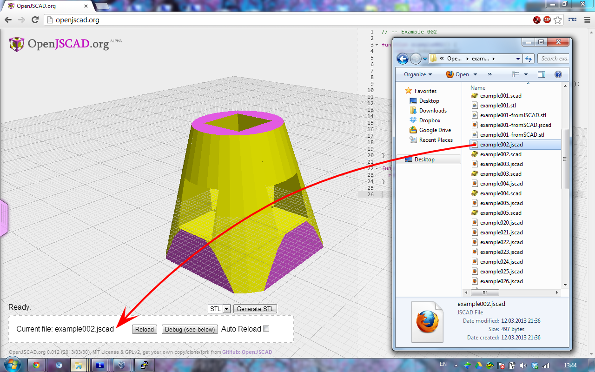
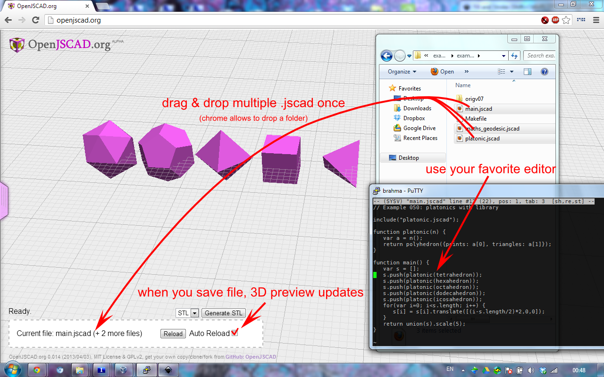

<h1>OpenJSCAD.org</h1>

<b>Version 0.5.2</b> (ALPHA)

<b>OpenJSCAD.org</b> is a more up-to-date <a href="http://joostn.github.com/OpenJsCad/">OpenJsCAD</a> frontend where you can edit .jscad files either locally or online via JS editor (built-in).
A few functions are available to make the transition from <a href="http://openscad.org/">OpenSCAD</a> to OpenJSCAD easier (<a href="https://github.com/Spiritdude/OpenSCAD.jscad">OpenSCAD.jscad</a> built-in),
as well CLI (command-line interface) for server-side computations with NodeJS.

<h2>Installation</h2>

<b>Immediate Use</b>: No installation, go to <b><a href="http://openjscad.org">OpenJSCAD.org</a></b> (Google Chrome, Firefox)

<b>Local Web Use:</b>
<pre>
% git clone https://github.com/Spiritdude/OpenJSCAD.org
% cd OpenJSCAD.org
% make install
</pre>

and then access the files via local web-site and your web-browser. 

<b>Local CLI Use:</b>

For CLI (command-line interface) rendering install <a href="http://nodejs.org/">NodeJS</a> as well, e.g. <tt>apt-get install nodejs</tt> (be aware <b>NodeJS &gt; 0.8.1 or newer is required</b>) and then test it:
<pre>
% cd examples/
% openjscad example005.jscad                         # -- creates example005.stl as default
% openjscad example001.jscad -o test.stl
% openjscad example001.scad -o example001scad.jscad  # -- convert .scad into .jscad
% openjscad frog.stl -o test.jscad                   # -- convert .stl into .jscad
% openjscad logo.jscad -of amf                       # -- convert logo.jscad into logo.amf
</pre>

<b>Note:</b> on some systems the NodeJS executable is <tt>node</tt> (default) or <tt>nodejs</tt>, edit <tt>openjscad</tt> first line to reflect this.

<h2>History</h2>
<ul>
<li>2016/10/01: 0.5.2: updated documentation links by Z3 Dev, updated Ace editor to 1.2.4, fixed AMF export to set colors only when provided, enhanced Processor constructor to support Viewer options, added big.html to provide an example of using Processor and Viewer options, enhanced Processor to retain multiple returned objects, fixed difference() and intersection() functions for CAG by fischman
<li>2016/06/27: 0.5.1: refactored AMF import and export, enhanced STL import by adding support for MM colors by Z3 Dev,added local storage by Robert Starkey
<li>2016/05/01: 0.5.0: added SVG import and export, added options to Processor and View classes, allow more flexibility in HTML by Z3 Dev
<li>2016/02/25: 0.4.0: refactored, functionality split up into more files, mostly done by Z3 Dev
<li>2015/10/23: 0.3.1: including new parameter options by Z3 Dev
<li>2015/07/02: 0.3.0: format.js (Stefan Baumann), and Blob.js/openjscad improved by Z3 Dev
<li>2015/05/20: 0.2.4: renumbering, latest csg.js from http://joostn.github.com/OpenJsCad/ adapted
<li>2015/04/08: 0.024: dev branch opened
<li>2015/02/14: 0.023: bumping version based on openscad.js
<li>2015/02/04; 0.020: browser window resizing done properly, thanks to Z3 devs via pull request
<li>2015/01/07: 0.019: various pull requests from github merged again
<li>2014/10/05: 0.018: various pull requests from github merged
<li>2013/04/11: 0.017: alpha channel supported in color() and .setColor()
<li>2013/04/07: 0.016: csg.js: solidFromSlices() and .setColor() on polygon level, and examples by Eduard Bespalov
<li>2013/04/05: 0.015: rudimentary AMF export and import, web and cli
<li>2013/04/03: 0.014: multiple files via drag & drop, developing locally
<li>2013/04/01: 0.013: include() on web-online & drag & drop (but not off-line) and cli (server-side)
<li>2013/03/20: 0.012: improved UI (slider from the left)
<li>2013/03/28: 0.011: added support for rectangular_extrude(), rotate_extrude() and torus()
<li>2013/03/22: 0.010: leave .scad file intact, and translate on-the-fly
<li>2013/03/20: 0.009: OpenSCAD .scad syntax support included via <a href="https://github.com/garyhodgson/openscad-openjscad-translator">openscad-openjscad-translator</a> module, on web and cli; and experimental .stl import support (binary & ascii)
<li>2013/03/15: 0.008: circle(), square(), polygon() partially and linear_extrude() implemented (openscad-like)
<li>2013/03/14: 0.007: integrating jQuery for new features; draggable hint window
<li>2013/03/12: 0.006: included examples available in the web-frontend direct
<li>2013/03/12: 0.005: supporting webgui parameters as of original OpenJsCad (see examples/example030.jscad)
<li>2013/03/11: 0.004: openscad.js: many improvements, more OpenSCAD-like functions
<li>2013/03/10: 0.003: solidify the functionality (few bug fixes)
<li>2013/03/10: 0.001: initial version
</ul>

See for more details <a href="https://plus.google.com/115007999023701819645">G+ OpenJSCAD.org Announcements</a> and
<a href="https://plus.google.com/communities/114958480887231067224">G+ OpenJSCAD Community</a> to discuss with other user and developers.

<h2>Todo</h2>
<ul>
<li> <del>3d primitive: <b>torus()</b></del> (done)
<li> <del>OpenSCAD .scad support for both Web-GUI and CLI</del> (done)
<li> <del><b>include()</b> for Web-GUI and CLI to include libraries and modules, support of multiple .jscad drag & drop with include()</del> (done) 
<li> <del>save from built-in editor to local</del> (done)
<li> <del>complete 2D primitives and transformations</del> (done)
<li> <del>implementation of <b>linear_extrude()</b> <b>rotate_extrude()</b>, parameter compatible to OpenSCAD</del> (done)
<li> <del>example of platonic solids (in progress, requires include())</del> (done)
<li> <del>simple 2D/3D text</del> (done)
<li> <del>2d operation: hull()</del> (done)
<li> processing/progress bar (0..100%), perhaps even visual progress seen in the model direct
<li> <del>STL importer</del> (done) & AMF importer / exporter
<li> integration into <a href="https://github.com/Spiritdude/RepRapCloud">RepRap Cloud</a> as first stage of the workflow
</ul>

<h2>Documentation</h2>
<ul>
<li><b><a href="https://en.wikibooks.org/wiki/OpenJSCAD_User_Guide">OpenJSCAD User & Programming Guide</a></b>
<li><b><a href="https://en.wikibooks.org/wiki/OpenJSCAD_Quick_Reference">OpenJSCAD Quick Reference</a></b>
</ul>

<h2>Screenshots</h2>

Simple JSCAD example (example000.jscad):

More sophisticated JSCAD example, fully object-oriented (OO) programmed with interactive parameters (example031.jscad):

Import of STL models:

Drag & drop a local file:

Drag & drop multiple files (Chrome & Firefox) or a folder (Chrome):

<h2>See Also</h2>
<ul>
<li><a href="http://joostn.github.com/OpenJsCad/">OpenJsCAD</a>, starting point of OpenJSCAD.org
<li><a href="http://garyhodgson.github.com/openscad.net/">OpenSCAD.net</a>, another place of inspiration, where the OpenSCAD translator was adapted from
<li><a href="http://kaosat-dev.github.com/CoffeeSCad/">CoffeeSCad</a>, JavaScript simplified (no more {}), very active development
<li><a href="http://rsmith.home.xs4all.nl/software/py-stl-stl2pov.html">stl2pov</a> tool to convert .stl to .pov, and then render via <a href="http://povray.org">PovRay.org</a>
<li><a href="https://github.com/D1plo1d/p3d">P3D</a> STL/AMF/OBJ viewer
</ul>

That's all for now,

Rene K. Mueller 
initial version 2013/03/10, updated 2013/04/04
