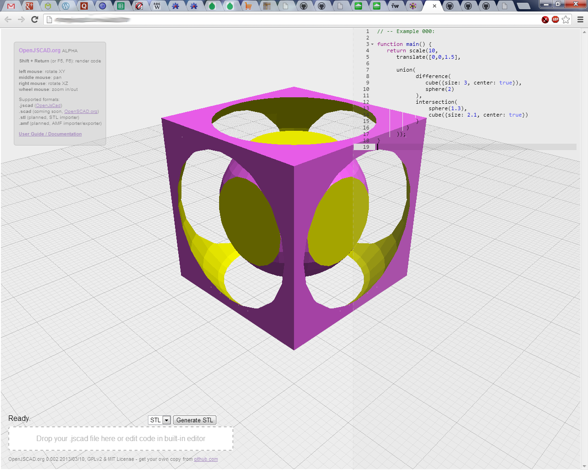

<h1>OpenJSCAD.org</h1>

<b>Version 0.004</b> (ALPHA)

<b>OpenJSCAD.org</b> is more up-to-date <a href="http://joostn.github.com/OpenJsCad/">OpenJsCAD</a> frontend where you can edit .jscad files either locally or online via JS editor (built-in).
A few functions are available to make the transition from <a href="http://openscad.org/">OpenSCAD</a> to OpenJSCAD easier (<a href="https://github.com/Spiritdude/OpenSCAD.jscad">OpenSCAD.jscad</a> built-in).

<h2>Installation</h2>

<b>Immediate Use</b>: No installation, go to <b><a href="http://openjscad.org">OpenJSCAD.org</a></b>

<b>Local Use:</b>
<pre>
% git clone https://github.com/Spiritdude/OpenJSCAD.org
</pre>

and then access the files via local web-site and your web-browser.

<h2>History</h2>
<ul>
<li>2013/03/11: 0.004: openscad.js: many improvements, more OpenSCAD-like functions
<li>2013/03/10: 0.003: solidify the functionality (few bug fixes)
<li>2013/03/10: 0.001: initial version
</ul>

<h2>Todo</h2>
<ul>
<li> 3d primitive: torus()
<li> save to local from built-in editor
<li> complete 2D primitives and transformations
<li> implementation of linear_extrude(), rotate_extrude() (parameter compatible or very close so)
<li> example of platonic solids (based on triangle())
<li> simple 2D/3D text
<li> 3d operation: hull()
<li> processing bar (0..100%), perhaps even visual progress seen in the model direct
<li> STL importer & AMF importer / exporter
<li> integration into <a href="https://github.com/Spiritdude/RepRapCloud">RepRap Cloud</a> as first stage of the workflow.
</ul>

<h2>Documentation</h2>
<ul>
<li><b><a href="wiki/User-Guide">OpenJSCAD User Guide</a></b>
</ul>

<h2>Screenshot</h2>

<h2>See Also</h2>
<ul>
<li><a href="http://joostn.github.com/OpenJsCad/">OpenJsCAD</a>, inspiration of this project and the following below
<li><a href="http://garyhodgson.github.com/openscad.net/">OpenSCAD.net</a>, another place of inspiration
<li><a href="http://kaosat-dev.github.com/CoffeeSCad/">CoffeeSCad</a>, JavaScript simplified (no more {}), very active development
</ul>

That's all for now,

Rene K. Mueller 
initial version 2013/03/10
