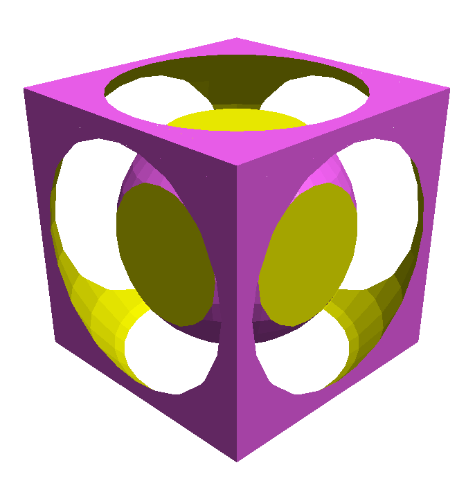

# OpenJSCAD

>*OpenJsCad* is a set of modular, browser and command line tools for creating parametric 2D & 3D designs with JavaScript code.



There are many ways to use OpenJSCAD: 

An [online version](https://openjscad.org/), [self hosteable web based ui](https://github.com/jscad/OpenJSCAD.org/raw/master/packages/web), as [CLI](https://github.com/jscad/OpenJSCAD.org/raw/master/packages/cli) (command-line interface) for server-side computations with Node.js, as well as an experimental [desktop app](https://github.com/jscad/jscad-desktop) or [individual Node.js modules](https://github.com/jscad/OpenJSCAD.org/raw/master/packages/README.md)!!

This repository is a [monorepo](https://medium.com/@maoberlehner/monorepos-in-the-wild-33c6eb246cb9) (container of multiple node.js packages & tools) maintaned with [Lerna](https://lernajs.io/)

[](https://travis-ci.org/jscad/OpenJSCAD.org)
[](https://github.com/emersion/stability-badges#stable)
[](https://lernajs.io/)

[](#backers) [](#sponsors) 

## Table of Contents

- [Usage](#usage)
- [Development](#development)
- [Documentation](#documentation)
- [Contribute](#contribute)
- [Community](#community)
- [Acknowledgements](#acknowledgements)
- [License](#license)
- [Screenshots](#screenshots)
- [See also](#see-also)

## Usage

There are different 'flavors' of OpenJscad that you can use based on your needs
- web: online (no install) simply go to [https://openjscad.org/](https://openjscad.org/)
- web: self hosted: can be found [here](./packages/web)
- cli: command line interface : can be found [here](./packages/cli)
- desktop app: pre pre alpha work in progress can be found [here](https://github.com/jscad/jscad-desktop)!
- node.js: custom mix & match of modules
  * all the packages are available [on npm](https://www.npmjs.com/search?q=%40jscad) under the '@jscad' name 
  * Geometric [core & modeling api](https://github.com/jscad/csg.js)
  * Input/output [formats handling stl, amf dxf, svg, etc](https://github.com/jscad/io/)

### Immediate Use (no installation)

Go to *[OpenJSCAD.org](http://openjscad.org)* (Tested browsers include Chrome, Firefox, Opera, Safari)

### Use within a Web Site (pre built files, from github)

please see [here for details](./packages/web/README.md)

### Use as Command Line Interface (CLI)

please see [here for details](./packages/cli/README.md)

### Use of the different modular components directly

From version 1.0.0 onwards, almost all the individual parts of this project are available
directly as scoped NPM modules , and can be used independently from this repo.
The full list of these is available [here](./packages/README.md) a here https://www.npmjs.com/org/jscad

One example of what can be achieved with this can be found [here](https://esnextb.in/?gist=0a2ac2c4e189e27692ea964956a3a2e5)
This means you can :
- easily create your own renderer for the CSG/Cag data structures
- create custom UIs
- use the different parts in Node.js or the Browser
- cherry pick what formats you want to use for input/output without needing the
dependencies of **all** packages
- lots more !

This will be expanded upon in the future, and is the backbone of the newer, modular Jscad

### Adding new features in CSG.js or other modules:
Since OpenJSCAD is made up of multiple dependent modules (csg.js, openscad-openjscad-translator etc),
the easiest method is to use ```npm link``` to have a 'live' updating development version of OpenJSCAD:
- create a base directory
- clone this repository ```git clone https://github.com/jscad/OpenJSCAD.org.git```
- go into OpenJSCAD.org folder ```cd OpenJSCAD.org```
- install dependencies ```npm install```
- if desired, make the ```openjscad``` command refer to the code in this folder: ```npm link```
- if desired, start dev server: ```npm run start-dev```

Then, for example for CSG.js:
- go back to base directory ```cd ..```
- clone CSG.js ```git clone https://github.com/jscad/csg.js.git```
- go into OpenJSCAD.org folder again ```cd OpenJSCAD.org```
- now type ```npm link ../csg.js``` to make @jscad/csg refer to local ../csg.js.

You can now make changes to the CSG.js code and see it impact your locally running
copy of OpenJSCAD live.
## Development

Please see the code and details in each [package](./packages) & their READMEs
You can link up all the code for simple development using the following command

```
npm run bootstrap
```
This command
- links up all the packages
- installs all of their dependencies

we also provide a few shortcuts for some of the specific subpackage to start development
```
npm run web // boostrap, go to the web UI package and start the dev server
```
```
npm run cli // bootstrap, go to the cli package
```

## Documentation

- [technical overview & Q&A](./docs/index.md)
- [OpenJSCAD User & Programming Guide](https://openjscad.org/dokuwiki/doku.php?id=start)
- [OpenJSCAD Quick Reference](https://openjscad.org/dokuwiki/doku.php?id=jscad_quick_reference)

## Contribute

OpenJSCAD.org is part of the JSCAD Organization, and is maintained by a group of volunteers. We welcome and encourage anyone to pitch in but please take a moment to read the following guidelines.

Thank you to all the people who have already contributed to this project:
<a href="graphs/contributors"></a>

* If you want to submit a bug report please make sure to follow the [Reporting Issues](https://github.com/jscad/OpenJSCAD.org/wiki/Reporting-Issues) guide. Bug reports are accepted as [Issues](https://github.com/jscad/OpenJSCAD.org/issues/) via GitHub.

* If you want to submit a change or a patch, please see the [Contributing guidelines](https://github.com/jscad/OpenJSCAD.org/blob/master/CONTRIBUTING.md). New contributions are accepted as [Pull Requests](https://github.com/jscad/OpenJSCAD.org/pulls/) via GithHub.

* We only accept bug reports and pull requests on **GitHub**.

* If you have a question about how to use the OpenJSCAD.org, then please start a conversation at the [OpenJSCAD.org User Group](https://plus.google.com/communities/114958480887231067224). You might find the answer in the [OpenJSCAD.org User Guide](https://openjscad.org/dokuwiki/doku.php?id=start).

* If you have a change or new feature in mind, please start a conversation with the [Core Developers](https://plus.google.com/communities/114958480887231067224) and start contributing changes.

Small Note: If editing this README, please conform to the [standard-readme](https://github.com/RichardLitt/standard-readme) specification.

## Community

See for more details
* [G+ OpenJSCAD.org Announcements](https://plus.google.com/communities/114958480887231067224)
* [G+ OpenJSCAD Community](https://plus.google.com/communities/114958480887231067224)
to discuss with other user and developers.

## Acknowledgements

OpenJSCAD and its sub components are built upon great open source work, contribution & modules
- [csg.js](https://github.com/jscad/csg.js) core & improvements by
Evan Wallace,
Eduard Bespalov,
Joost Nieuwenhuijse,
Alexandre Girard

For input/output
- [xmldom](https://github.com/jindw/xmldom)
- [sax](https://github.com/isaacs/sax-js)

Tooling:
- [browserify](http://browserify.org/)
- [babel](https://babeljs.io/)

and many more!

## Backers

Thank you to all our backers! 🙏 [[Become a backer](https://opencollective.com/openjscad#backer)]

<a href="https://opencollective.com/openjscad#backers" target="_blank"></a>


## Sponsors

Support this project by becoming a sponsor. Your logo will show up here with a link to your website. [[Become a sponsor](https://opencollective.com/openjscad#sponsor)]

<a href="https://opencollective.com/openjscad/sponsor/0/website" target="_blank"></a>
<a href="https://opencollective.com/openjscad/sponsor/1/website" target="_blank"></a>
<a href="https://opencollective.com/openjscad/sponsor/2/website" target="_blank"></a>
<a href="https://opencollective.com/openjscad/sponsor/3/website" target="_blank"></a>
<a href="https://opencollective.com/openjscad/sponsor/4/website" target="_blank"></a>
<a href="https://opencollective.com/openjscad/sponsor/5/website" target="_blank"></a>
<a href="https://opencollective.com/openjscad/sponsor/6/website" target="_blank"></a>
<a href="https://opencollective.com/openjscad/sponsor/7/website" target="_blank"></a>
<a href="https://opencollective.com/openjscad/sponsor/8/website" target="_blank"></a>
<a href="https://opencollective.com/openjscad/sponsor/9/website" target="_blank"></a>


## License

[The MIT License (MIT)](https://github.com/jscad/OpenJSCAD.org/blob/master/LICENSE)
(unless specified otherwise)

## Screenshots

Simple JSCAD example ([logo.jscad](examples/logo.jscad)) [try it](http://openjscad.org/#examples/logo.jscad):


More sophisticated JSCAD example, with functions dedicated to object generation and with interactive parameters ([gear.jscad](examples/gear.jscad)) [try it](http://openjscad.org/#examples/gear.jscad) :


Import of STL models ([frog-OwenCollins.stl](examples/frog-OwenCollins.stl)) [try it](http://openjscad.org/#examples/frog-OwenCollins.stl):


Drag & drop a local file:


Drag & drop multiple files (Chrome & Firefox) or a folder (Chrome):


## See Also

- [OpenJsCAD](http://joostn.github.com/OpenJsCad/), starting point of OpenJSCAD.org
- [OpenSCAD.net](http://garyhodgson.github.com/openscad.net/), another place of inspiration, where the OpenSCAD translator was adapted from
- [CoffeeSCad](http://kaosat-dev.github.com/CoffeeSCad/), JavaScript simplified (no more {}) (defunct)
- [stl2pov](http://rsmith.home.xs4all.nl/software/py-stl-stl2pov.htmltool) to convert .stl to .pov, and then render via [PovRay.org](http://povray.org)
- [P3D](https://github.com/D1plo1d/p3d) STL/AMF/OBJ viewer

That's all for now,

Rene K. Mueller, Jeff Gay, Mark Moissette & JSCAD Organization
