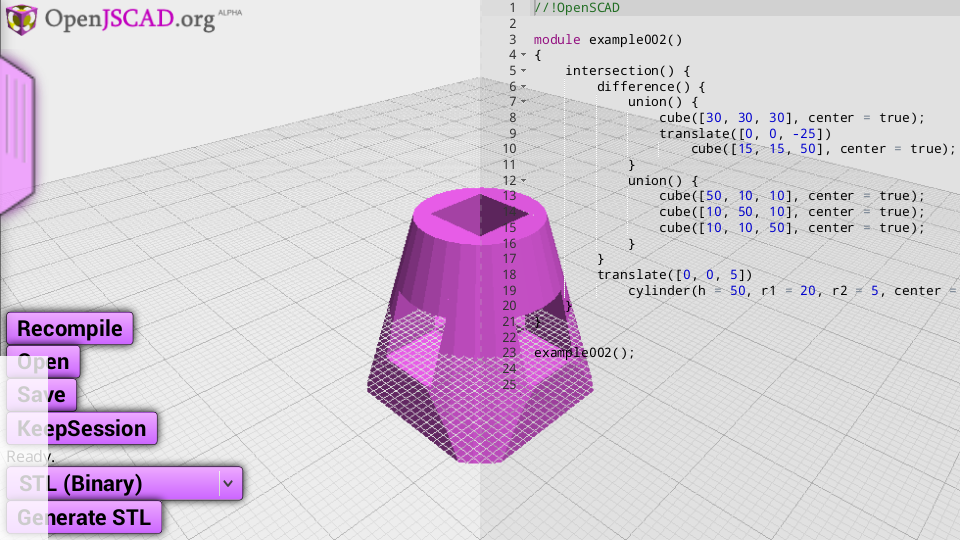
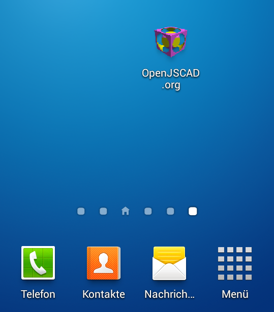

<h1>OpenJSCAD@Android</h1>

This is just a minimalistic mod of the original <a href="https://github.com/Spiritdude/OpenJSCAD.org">OpenJSCAD</a>
to give it a try on my android devices.  

<h2>Preparations</h2>
<pre>
Download the ZIP file from GitHub or clone this fork
% git clone https://github.com/miguelitoelgrande/OpenJSCAD.org
cd to the OpenJSCAD.org local copy.
You may remove the "OpenJSCAD.org.wiki" and "doc" folders and also most of the "examples" if you really want to reduce the footprint to less than 2MB.
</pre>

 
<h2>Instructions for Mobile Device use as a Local Installation:</h2>
<pre>
Copy the OpenJSCAD.org folder to the internal Android SD Storage.
Rename the folder, it should now be found as /sdcard/OpenJSCAD with a file browser on your device.
Use FireFox on Android, preferrably with the "Fullscreen" add-on.
Type the URL:  
file:///sdcard/OpenJSCAD/phone.html
DONE.
</pre>
Create an icon on the launcher as you like. 

 
<h2>Server-sided installation</h2>
<pre>
Almost the same as above.
Copy the folder to your webspace.
Point your device to http://yourspace/OpenJSCAD/phone.html  
DONE.
</pre>

<h2>Additional functionality in this mod</h2>
<ul>
<li>One Finger touch gesture on the left half of the screen will rotate the 3D view.
<li>Two finger pinch gestures (careful!) will zoom.
<li>Three fingers will pan the view.

<li>"Open" will allow to browse for local (.scad/.jscad) files on the device.
<li>"Save" will download the editor content to the browsers download folder.

<li>"KeepSession" will save editors content to localStorage of browser.
<li>earlier session will be loaded, if stored with THIS browser and same URL.
<li>Recompile Button: Click this button after changing or loading source.
<li>Stripped down menu. But new functionality mentioned there.
<li>Push the menu handle to toggle menu.

</ul>

 

<h2>Major Changes</h2>
<ul>
<li>Reduced footprint (everything in 2MB possible)
<li>Added simple touch support (cf. openjscad.js).
<li>phone.html and style_phone.css as derivate of index.html mainly to optimize for tiny screens.
<li>Menu toggles on/off on handle bar -> hover does not work well on touch.
<li>* Extra buttons: File operations as drag and drop not possible.
<li>* Compile Button additional to Shift+Control
<li>* Ability to store editor contents in browser across sessions (localStorage).
</ul>

<h2>Limitations</h2>
several, but specifically
<ul>
<li>* The Swype-Keyboard on Android does not support backspace. Use another keyboard for editing.
<li>* Flipping screen orientation not recommended. rather refresh page afterwards.
</ul>

