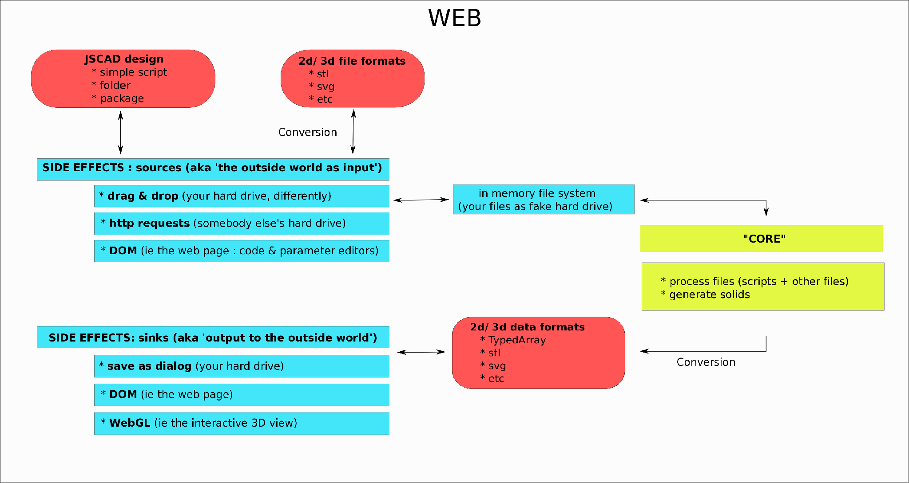
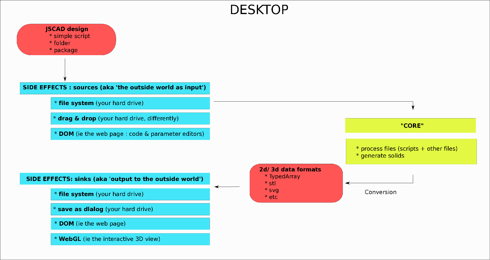
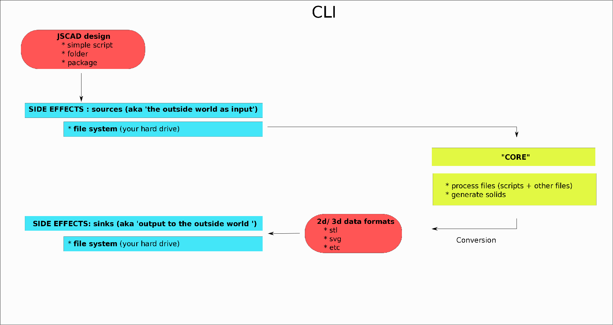

# JSCAD: overview

This document aims to help users and developpers gain a better understanding of its goals, structure, logic and parts.

## Table of Contents

- [Frequently asked questions](#frequently-asked-questions)
- [Overview](#overview)


## Frequently asked questions

* Q: why are there two different apis to do (almost) the same things ? ie CSG.sphere() vs sphere()
A: this is due to how the project was developped on top of CSG.js : there were initial implementations,
(CSG.XXX) and another 'layer' was added on top to be more functional oriented and similar to OpenSCAD

> From version v2.0 onwards there will only be a single, functional oriented, unified API that takes
some aspects of both the 'older' apis

* Q: why are there some functions that take options first , objects second, while others take objects first,
options second
A: A lot of very nice functionality was added without taking overall coherence into account: this is something that will be fixed from v2.0 onwards : the rule of thumb will be **options first, objects second**

* Q: why options first ?
A: A few reasons:
  * making functional composition easier (currying etc) see the rationale behind similar decisions in [Ramda]()
  and [Lodash-fp]()
  * a lot of functions can accept a variable number of objects to operate on, but a single set of params : for example ```translate(options, obj1, obj2, obj3...)```


## Overview
  ### How jscad works (from a distance)

  Each 'flavor' of jscad has a different set of available **inputs & output** (called **side effects**): ie , 
  * the desktop and CLI versions obviously have access to your hard drive in an unrestrained manner
  * while the web version only has access to what files & folders you drag & drop onto it , and what you write in the editor

  ### Web

  

  ### Desktop

  

  ### CLI

  

