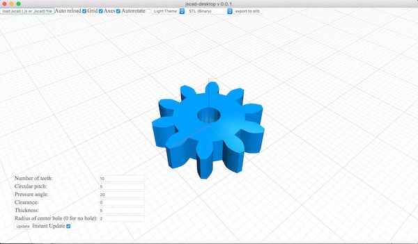
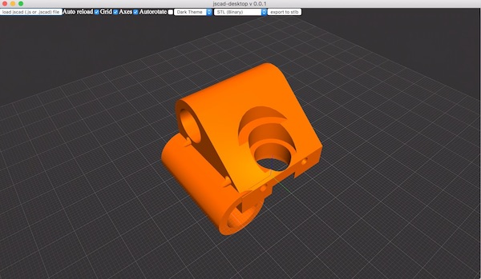

# @jscad/desktop

[](https://badge.fury.io/gh/jscad%2Fdesktop)
[](https://travis-ci.org/jscad/desktop)





> Experimental desktop JSCAD (openjscad) client, built using Electron

A LOT OF THE THINGS HERE CAN AND WILL CHANGE!! This softare is pre-alpha, use at your own risk etc !

## Overview

- this app works pretty much like the web based JSCAD
(but does not included a text editor, see below)
- it automatically saves & reloads most settings and the last design you were working on on restart
- there is basic theming support (only two are present, you can change them but not add more at this time)
- uses the shiny new 3D viewer based on regl
- uses most.js observables & a declarative approach internally

### what is supported:
 * almost all of the features of JSCAD web EXCEPT the things in the paragraph below 

### what is not supported
  - the include() function , [since include is EVIIIL and an antipattern
(an alternative to include() will soon be provided)](https://github.com/jscad/OpenJSCAD.org/issues/245)
  - direct loading/conversion of other formats expect for .js/jscad is not supported (yet)
  - there is no text editor included, because I am still on the fence about including one: why have something half baked when there are so many great , free & open source code editors these days ? ([Atom](https://atom.io/), [Visual Studio Code](https://code.visualstudio.com/))

### script handling
 * you can either select a file (jscad or js) or folder from the load jscad menu or drag & drop a file or folder
  * the lookup in folders is done as follows : 
    - if there is a package.json file, the file specified in the 'main' field is used (standard node.js)
    - if there is no package.json the program tried to look for either an index.js/jscad file or a main.js/jscad file
    - if that fails it tries to look for a js/jscad file that has the same name as the folder
 *  unlike the web based UI you can (and are **encouraged to**) use jscad designs defined as common.js modules, so you can use
 ```require(<moduleName>)``` calls to include other functions, shapes etc
 * in your main file, when using common.js modules please use named exports ie :
  ```javascript module.exports = {main, getParameterDefinitions}```
 * VERY IMPORTANT : if you use common.js modules you HAVE to `require()` all the JSCAD packages you use (like `@jscad/csg` etc) **yourself**: if the app detects that you do not have `module.exports`, then it will inject all the JSCAD api itself, with a MAJOR limitation at this time:
  you cannot make require() calls from anything but the root level file, and you do not have access to the API (this will get fixed)

 > there will NOT be out of the box support for es6 modules anytime soon, please use a transpiler (Babel.js etc) if you want to use es modules

### geometry caching

 this is an experimental feature that adds a HUGE performance boost by turning the various geometry creation
 functions (so cube(), sphere(), union(), difference() etc into a virtual tree, and caching each of the items in the tree when evaluating the tree into actual csg/cag object
 you can see more information about it [here](https://github.com/kaosat-dev/jscad-tree-experiments)

  >Tip:
  to take even more advantage of this feature, please have your *main()* script return an array of shapes
  if there are multiple independant shapes/parts, as union() operations are more costly

  This desktop app also saves your current design's cache to the hard drive, making a reload after restarting the app very fast! IF you follow the instructions/limitations below
  
#### Limitations

- LIMITATION 1 :
 this **ONLY WORKS WITH THE FUNCTIONAL API** !! ie 
 cube(), sphere(), union(), difference(), translate(), scale() etc
 but **NOT** CSG.cube(), csgObject.union(xxx), csgObject.translate(xxx)

- LIMITATION 2: because of the limitation above you CANNOT mix the two coding styles: so this is **FUNCTIONAL API ONLY, NO MIXING** !!
 since the non functional api will become deprecated soon, this is future facing decision regardless :)

### How to use it : (temporary instructions)

  > Note: this is experimental, and somewhat clunky, will VERY LIKELY change in the future !!!

  1 - with explicit require() calls (prefered method)

  - toggle the 'Experimental geometry caching:' setting in the options panel (turned off by default)

  - install the following package in your design

    ```npm install kaosat-dev/jscad-tree-experiments```

  - replace your ```require('@jscad/csg/api')``` calls with ```require('@jscad/vtree').api```

  - example :

    this script 
    ```javascript 
      const {cylinder} = require('@jscad/csg/api').primitives3d
      const {color} = require('@jscad/csg/api').color
      const {difference} = require('@jscad/csg/api').booleanOps
      const {translate} = require('@jscad/csg/api').transformations

      module.exports = function assemblyMount (params) {
        const {plateThickness, plateOffset, assemblyMountDia, assemblyMountBoltDia} = params
        return translate([0, 0, plateThickness], color('gray',
          difference(
            cylinder({h: plateOffset - plateThickness, d: assemblyMountDia}),
            cylinder({h: plateOffset - plateThickness, d: assemblyMountBoltDia})
          )
        ))
      }
    ```
    should become

    ```javascript

      const {cylinder} = require('@jscad/vtree').api.primitives3d
      const {color} = require('@jscad/vtree').api.color
      const {difference} = require('@jscad/vtree').api.booleanOps
      const {translate} = require('@jscad/vtree').api.transformations

      module.exports = function assemblyMount (params) {
        const {plateThickness, plateOffset, assemblyMountDia, assemblyMountBoltDia} = params
        return translate([0, 0, plateThickness], color('gray',
          difference(
            cylinder({h: plateOffset - plateThickness, d: assemblyMountDia}),
            cylinder({h: plateOffset - plateThickness, d: assemblyMountBoltDia})
          )
        ))
      }
    ```

    you can find an example design that uses these imports and makes full use of the speedups here:
    https://github.com/kaosat-dev/Isolos

  2 - For old still scripts without explicit require() calls

  just toggle the 'Experimental geometry caching:' setting in the options panel (turned off by default)
  be warned however that a lot of the official examples etc will not work with this out of the box

### translations

This version of Jscad has support for multiple languages (as in text for the UI, not programming languages):
- English
- German
- French

you can find the language files in the **locales** folder 
* Language will default to your system's locale
* feel free to add pull requests if you see issues with the current translations or if you want to 
add translations for another one !
* in the near future this will also be available for the non-desktop versions!

pre-alpha, expect bugs! 

## Table of Contents

- [Installation](#installation)
- [Usage](#usage)
- [Contributing](#Contributing)
- [License](#license)

## Installation

For now , dev mode only! 

```
git clone https://github.com/jscad/OpenJSCAD.org.git
cd OpenJSCAD.org
npm install
npm test
```

## Usage

For now , dev mode only! 

To start the app, in the root folder , type
```
cd packages/desktop
npm run dev
```
- drag & drop a jscad/js file to get started
- left/right drag to rotate camera
- shift + drag to pan 
- double click to reset camera & controls
- tripple click to zoomToFit on the items in the scene
- there are also keyboard shortcuts for camera angles and orthographic/perspective you can take a look at them & change them in the data/keybindings.json file (requires restart)

   * `t` : top view
   * `b` : bottom view
   * `l` : left view
   * `r` : right view
   * `f`: front view
   * `b`: back view
   (yes 'b' is bound to both bottom & back views, whoops)
   * warning ! panning is broken in orthographic mode
   * `p`: perspective projection
   * `o`: orthographic projection
- most of the ui options should be explicit

## Contributing

The various JSCAD packages and all source code are part of the JSCAD Organization, and maintained by a group of volunteers.
We welcome and encourage anyone to pitch in but please take a moment to read the following guidelines.

* If you want to submit a bug report please make sure to follow the [Reporting Issues](https://github.com/jscad/OpenJSCAD.org/wiki/Reporting-Issues) guide. Bug reports are accepted as [Issues](https://github.com/jscad/OpenJSCAD.org/issues/) via GitHub.

* If you want to submit a change or a patch, please read the [Contributing Guide](https://github.com/jscad/OpenJSCAD.org/blob/master/CONTRIBUTING.md) . New contributions are accepted as [Pull Requests](https://github.com/jscad/OpenJSCAD.org/pulls/) via GithHub.

* We only accept bug reports and pull requests on **GitHub**.

* If you have a question about how to use JSCAD, then please start a conversation at the [JSCAD User Group](https://jscad.xyz/forum). You might find the answer in the [JSCAD.org User Guide](https://openjscad.org/dokuwiki/doku.php).

* If you have a change or new feature in mind, please start a conversation with the [Core Developers](https://jscad.xyz/forum) and start contributing changes.

Small Note: If editing this README, please conform to the [standard-readme](https://github.com/RichardLitt/standard-readme) specification.

## License

[The MIT License (MIT)](https://github.com/jscad/OpenJSCAD.org/blob/master/LICENSE)
(unless specified otherwise)
