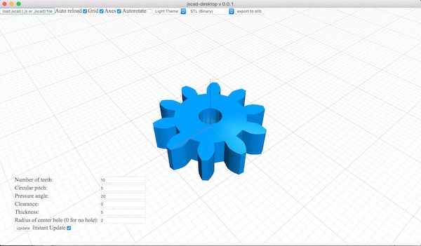
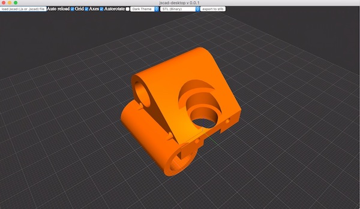

# jscad-desktop

[](https://badge.fury.io/gh/jscad%2Fdesktop)
[](https://travis-ci.org/jscad/desktop)





> Experimental desktop jscad (openjscad) client, built using Electron

A LOT OF THE THINGS HERE CAN AND WILL CHANGE!! This softare is pre-alpha, use at your own risk etc !

## Overview

- this app works pretty much like the web based OpenJSCAD.org
(but does not included a text editor, see below)
- it automatically saves & reloads most settings and the last design you were working on on restart
- there is basic theming support (only two are present, you can change them but not add more at this time)
- uses the shiny new 3D viewer based on regl
- uses most.js observables & a declarative approach internally


### what is supported:
 * almost all of the features of OpenJSCAD EXCEPT the things in the paragraph below 

### what is not supported
  - the include() function , [since include is EVIIIL and an antipattern
(an alternative to include() will soon be provided)](https://github.com/jscad/OpenJSCAD.org/issues/245)
  - direct loading/conversion of other formats expect for .js/jscad is not supported (yet)
  - scripts are not evaluated in a background worker, so the Ui will freeze when evaluating complex designs (this will be fixed
  down the line)
  - there is no text editor included, because I am still on the fence about including one: why have something half baked when there are so many great , free & open source code editors these days ? ([Atom](https://atom.io/), [Visual Studio Code](https://code.visualstudio.com/))
  - transitive file watching is not yes supported: ie if you change things outside of your main file, the ui will not update
  - file watching can fire change events twice occasionaly

### script handling
 * you can either select a file (jscad or js) or folder from the load jscad menu or drag & drop a file or folder
  * the lookup in folders is done as follows : 
    - if there is a package.json file, the file specified in the 'main' field is used (standard node.js)
    - if there is no package.json the program tried to look for either an index.js/jscad file or a main.js/jscad file
    - if that fails it tries to look for a js/jscad file that has the same name as the folder
 *  unlike the web based UI you can (and are **encouraged to**) use jscad designs defined as common.js modules, so you can use
 ```require(<moduleName>)``` calls to include other functions, shapes etc
 * in your main file, when using common.js modules please favor named exports ie :
  ```javascript module.exports = {main, getParameterDefinitions}```
 * VERY IMPORTANT : if you use common.js modules you HAVE to `require()` all the OpenJSCAD modules you use (like `@jscad/csg` etc) **yourself**: if the app detects that you do not have `module.exports`, then it will inject all the OpenJSCAD api itself, with a MAJOR limitation at this time:
  you cannot make require() calls from anything but the root level file, and you do not have access to the API (this will get fixed)

 > there will NOT be out of the box support for es6 modules anytime soon, please use a transpiler (Babel.js etc)

pre-alpha, expect bugs! 

## Table of Contents

- [Installation](#installation)
- [Usage](#usage)

## Installation

```
git clone this repository
cd jscad-desktop
npm i
```

## Usage

For now , dev mode only! 
to start the app, in the root folder , type
```
npm run dev
```

- drag & drop a jscad/js file to get started
- left/right drag to rotate camera
- shift + drag to pan 
- double click to reset camera & controls
- tripple click to zoomToFit on the items in the scene
- there are also keyboard shortcuts for camera angles and orthographic/perspective you can take a look at them & change them in the data/keybindings.json file (requires restart)

   * `t` : top view
   * `b` : bottom view
   * `l` : left view
   * `r` : right view
   * `f`: front view
   * `b`: back view
   (yes 'b' is bound to both bottom & back views, whoops)
   * warning ! panning is broken in orthographic mode
   * `p`: perspective projection
   * `o`: orthographic projection
- most of the ui options should be explicit


## License

[The MIT License (MIT)](./LICENSE)
(unless specified otherwise)
