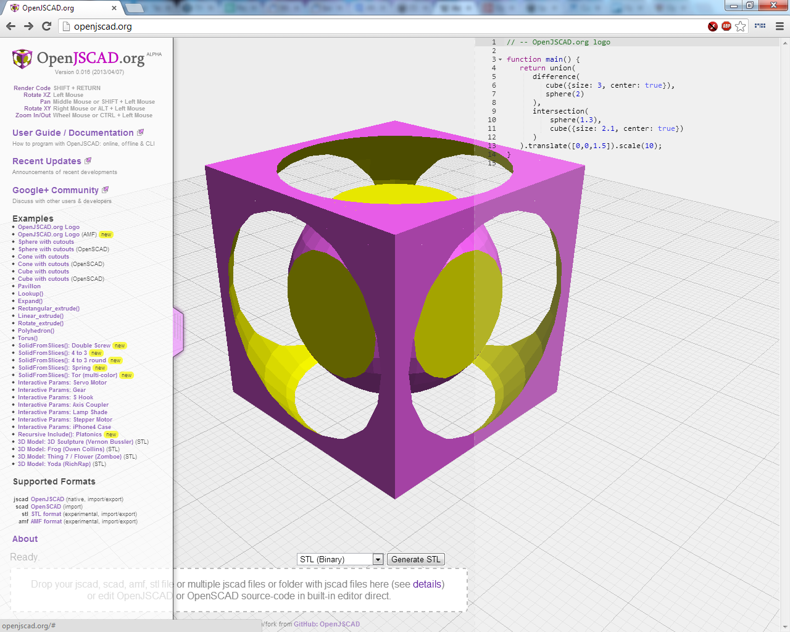

# @jscad/web: OpenJSCAD Web UI

This is the Web based UI for [OpenJsCAD](https://github.com/jscad/OpenJSCAD.org), either to host yourself, or use directly at https://openjscad.org/.


[](https://badge.fury.io/js/%40jscad%2Fweb)
[](https://travis-ci.org/jscad/OpenJSCAD.org)
[](https://github.com/emersion/stability-badges#stable)

[](https://david-dm.org/jscad/OpenJSCAD.org)
[](https://david-dm.org/jscad/OpenJSCAD.org#info=devDependencies)
[](https://lernajs.io/)

[](#backers) [](#sponsors) 

## Table of Contents

- [Usage](#usage)
- [Development](#development)
- [Documentation](#documentation)
- [Known issues](#known-issues)
- [Contribute](#contribute)
- [Community](#community)
- [Acknowledgements](#acknowledgements)
- [License](#license)
- [Screenshots](#screenshots)
- [See also](#see-also)

## Usage

### Immediate Use (no installation)

Go to *[OpenJSCAD.org](http://openjscad.org)* (Tested browsers include Chrome, Firefox, Opera, Safari)

### Use within a Web Site (pre built files)

```
cd base-directory-of-website
git clone https://github.com/jscad/OpenJSCAD.org
cd OpenJSCAD.org
cd packages/web . // this is where the web version is
cp ../examples ./examples // copy the examples here
<start a web server here>
```
And then access the contents via the URL of the web-site.
  * index.html for the standard version
  * viewer-minimal.html for the barebones viewer
  * viewer-options.html for the 'all options' variant of the above


>NOTE: You might need configuration changes to allow access to the some of the contents (examples etc).

### Use within a Web Site (custom build)

```
install node.js > 6.0
cd base-directory-of-website
git clone https://github.com/jscad/OpenJSCAD.org
cd OpenJSCAD.org
npm run boostrap
cd packages/web . // this is where the web version is
cp ../examples ./examples // copy the examples here
<start a web server here>
modify the code as you see fit (see 'Adding new features the other modules in this repository' section)
```


#### Use of proxies for remote file loading:

if you want the capability , just like the official OpenJSCAD.org site, to load remote projects/files directly
from the web based user interface, but without the hassle with CORS issues,
you can use a proxy file (see [remote.pl](./remote.pl) & [remote.php](./remote.php)):
this is a server side script that does the following
- caches the remote file locally on the server
- returns the local path to the downloaded file for OpenJSCAD to use

use and path of the proxy can be set by:
- changing the `proxyUrl` value in [src/ui/index.js](src/ui/index.js)
- since this is hardcoded , if you do not use the provided dev server,
 rebuild your main file (npm run build-web etc, see [Development](#development))


then you can use it like so:
https://<YOURSITE>/?uri=http://www.thingiverse.com/download:164128
or
https://<YOURSITE>/#http://www.thingiverse.com/download:164128

>Note: a PR with a node.js based proxy would be a welcome addition :)

## Development

We offer pre-built versions of OpenJSCAD to be uses directly here :
- [standard](./dist/index.js)
- [minimalist](./dist/min.js)
- [with options](./dist/options.js)

but you can also rebuild them manually if you need :

- standard: ```npm run build-web```
- minimalist: ```npm run build-min```
- with options: ```npm run build-opt```


### Adding new features the other modules in this repository:
Since OpenJSCAD is made up of multiple dependent modules (csg.js, openscad-openjscad-translator etc),
the easiest method is to use ```npm link``` to have a 'live' updating development version of OpenJSCAD:
- create a base directory
- clone this repository ```git clone https://github.com/jscad/OpenJSCAD.org.git```
- go into OpenJSCAD.org folder ```cd OpenJSCAD.org```
- install dependencies & setup inter package links ```npm run bootstrap```
- go into the web folder : ```cd packages/web````
- if desired, start dev server: ```npm run start-dev```

> Note : you can also change the code in all the other packages/xxx folders and it will also
impact the web ui (ie : if you make changes to packages/core in parts that are used in the Web Ui,
you do not need to run additional commands)

### Adding new features in CSG.js or other modules:

Then, for example for CSG.js:
- go back to base directory ```cd ..```
- clone CSG.js ```git clone https://github.com/jscad/csg.js.git```
- go into OpenJSCAD.org folder again ```cd OpenJSCAD.org```
- now type ```npm link ../csg.js``` to make @jscad/csg refer to local ../csg.js.

You can now make changes to the CSG.js code and see it impact your locally running
copy of OpenJSCAD live.

## Documentation

- [OpenJSCAD User & Programming Guide](https://openjscad.org/dokuwiki/doku.php?id=start)
- [OpenJSCAD Quick Reference](https://openjscad.org/dokuwiki/doku.php?id=jscad_quick_reference)

## Known Issues

There are a few known issues, please be sure to check this out before submitting additional bug reports/issues.

- Q: issues running certain npm commands like ```npm run build-web``` with [cnpm](https://github.com/cnpm/cnpm)
- A: this is a [know issue in cnpm](https://github.com/cnpm/cnpm/issues/214) , see [issue #283](https://github.com/jscad/OpenJSCAD.org/issues/283) for more information

- Q: Attempting to use OpenJSCAD from file:// in Chrome results in errors like
"File Error: [EncodingError] Please check permissions error."
- A: This is a permissions issue in Chrome :  restart chrome using the "--allow-file-access-from-files" option

## Contribute

OpenJSCAD.org is part of the JSCAD Organization, and is maintained by a group of volunteers. We welcome and encourage anyone to pitch in but please take a moment to read the following guidelines.

Thank you to all the people who have already contributed to this project:
<a href="graphs/contributors"></a>

* If you want to submit a bug report please make sure to follow the [Reporting Issues](https://github.com/jscad/OpenJSCAD.org/wiki/Reporting-Issues) guide. Bug reports are accepted as [Issues](https://github.com/jscad/OpenJSCAD.org/issues/) via GitHub.

* If you want to submit a change or a patch, please see the [Contributing guidelines](https://github.com/jscad/OpenJSCAD.org/blob/master/CONTRIBUTING.md). New contributions are accepted as [Pull Requests](https://github.com/jscad/OpenJSCAD.org/pulls/) via GithHub.

* We only accept bug reports and pull requests on **GitHub**.

* If you have a question about how to use the OpenJSCAD.org, then please start a conversation at the [OpenJSCAD.org User Group](https://plus.google.com/communities/114958480887231067224). You might find the answer in the [OpenJSCAD.org User Guide](https://openjscad.org/dokuwiki/doku.php?id=start).

* If you have a change or new feature in mind, please start a conversation with the [Core Developers](https://plus.google.com/communities/114958480887231067224) and start contributing changes.

Small Note: If editing this README, please conform to the [standard-readme](https://github.com/RichardLitt/standard-readme) specification.

## Community

See for more details
* [G+ OpenJSCAD.org Announcements](https://plus.google.com/communities/114958480887231067224)
* [G+ OpenJSCAD Community](https://plus.google.com/communities/114958480887231067224)
to discuss with other user and developers.

## Acknowledgements

OpenJSCAD and its sub components are built upon great open source work, contribution & modules
- [csg.js](https://github.com/jscad/csg.js) core & improvements by
Evan Wallace,
Eduard Bespalov,
Joost Nieuwenhuijse,
Alexandre Girard

For input/output
- [xmldom](https://github.com/jindw/xmldom)
- [sax](https://github.com/isaacs/sax-js)

Tooling:
- [browserify](http://browserify.org/)
- [babel](https://babeljs.io/)

and many more!

## Backers

Thank you to all our backers! 🙏 [[Become a backer](https://opencollective.com/openjscad#backer)]

<a href="https://opencollective.com/openjscad#backers" target="_blank"></a>


## Sponsors

Support this project by becoming a sponsor. Your logo will show up here with a link to your website. [[Become a sponsor](https://opencollective.com/openjscad#sponsor)]

<a href="https://opencollective.com/openjscad/sponsor/0/website" target="_blank"></a>
<a href="https://opencollective.com/openjscad/sponsor/1/website" target="_blank"></a>
<a href="https://opencollective.com/openjscad/sponsor/2/website" target="_blank"></a>
<a href="https://opencollective.com/openjscad/sponsor/3/website" target="_blank"></a>
<a href="https://opencollective.com/openjscad/sponsor/4/website" target="_blank"></a>
<a href="https://opencollective.com/openjscad/sponsor/5/website" target="_blank"></a>
<a href="https://opencollective.com/openjscad/sponsor/6/website" target="_blank"></a>
<a href="https://opencollective.com/openjscad/sponsor/7/website" target="_blank"></a>
<a href="https://opencollective.com/openjscad/sponsor/8/website" target="_blank"></a>
<a href="https://opencollective.com/openjscad/sponsor/9/website" target="_blank"></a>


## License

[The MIT License (MIT)](https://github.com/jscad/OpenJSCAD.org/blob/master/LICENSE)
(unless specified otherwise)

## Screenshots

Simple JSCAD example ([logo.jscad](examples/logo.jscad)) [try it](http://openjscad.org/#examples/logo.jscad):


More sophisticated JSCAD example, with functions dedicated to object generation and with interactive parameters ([gear.jscad](examples/gear.jscad)) [try it](http://openjscad.org/#examples/gear.jscad) :


Import of STL models ([frog-OwenCollins.stl](examples/frog-OwenCollins.stl)) [try it](http://openjscad.org/#examples/frog-OwenCollins.stl):


Drag & drop a local file:


Drag & drop multiple files (Chrome & Firefox) or a folder (Chrome):


## See Also

- [OpenJsCAD](http://joostn.github.com/OpenJsCad/), starting point of OpenJSCAD.org
- [OpenSCAD.net](http://garyhodgson.github.com/openscad.net/), another place of inspiration, where the OpenSCAD translator was adapted from
- [CoffeeSCad](http://kaosat-dev.github.com/CoffeeSCad/), JavaScript simplified (no more {}) (defunct)
- [stl2pov](http://rsmith.home.xs4all.nl/software/py-stl-stl2pov.htmltool) to convert .stl to .pov, and then render via [PovRay.org](http://povray.org)
- [P3D](https://github.com/D1plo1d/p3d) STL/AMF/OBJ viewer

That's all for now,

Rene K. Mueller, Jeff Gay, Mark Moissette & JSCAD Organization
